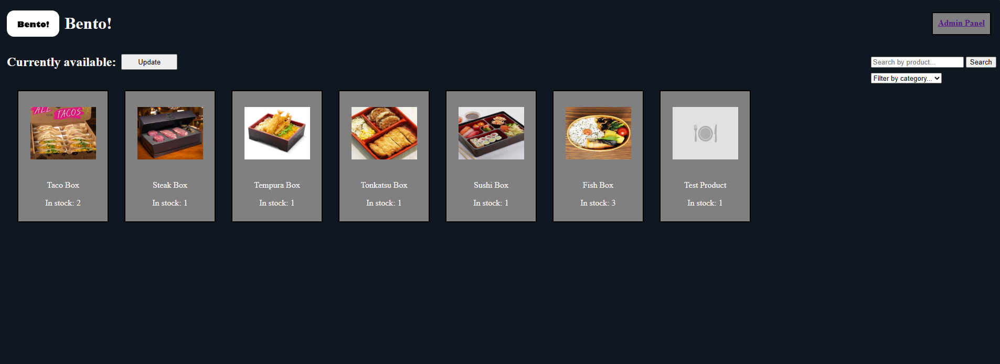
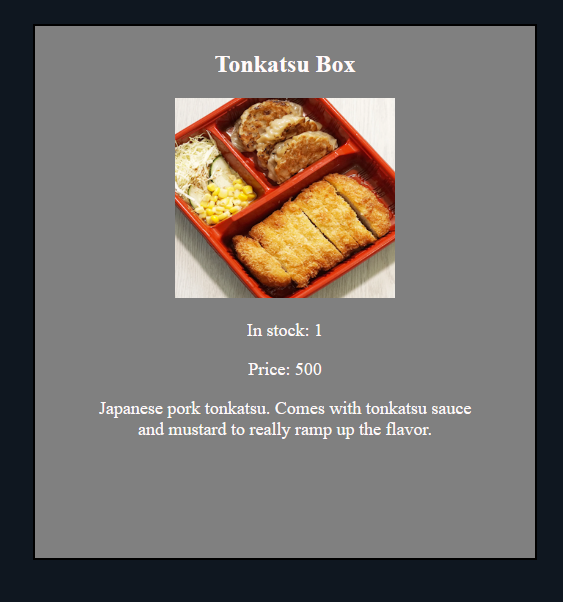
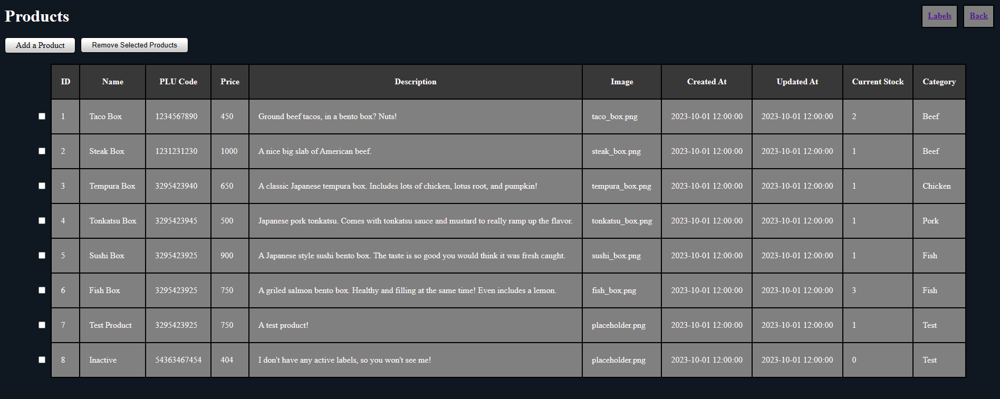

## Bento!

A proof-of-concept web application meant to emulate a hypothetical "bento box" listing page for an imaginary supermarket, created to practice using Laravel 10.

It emulates a real-time display of a store's current stock of bento boxes, allowing a user to easily see a store's inventory without having to visit the store.

Features an admin panel to view the back-end status and add/delete existing items.

## Sample Images
Main Page



Product Listing



Admin Panel



## Setup

Run locally (Requires PHP and Composer) using the following command from the main directory:
```
php artisan serve
```

Or, create a Container using the Docker Image below.

## Usage
1. Click the "Update" button to see a listing of active products.
2. Use the admin panel to add new products.
3. Make sure to attach an active label (Pack Status = 1: onSale) to your products, or else they won't be displayed.

## Docker Image

Built on a PHP 8.2.13/Alpine Linux base.  

https://hub.docker.com/r/danc98/bento-app 

Docker Pull Command
```
pull danc98/bento-app:latest
```

Docker Run Command
```
docker run --rm -t -p 8000:80 danc98/bento-app
```
Exposes to port 8000. Navigate to localhost:8000 to view.

## Framework

<p align="center"><a href="https://laravel.com" target="_blank"></a></p>

<p align="center">
<a href="https://github.com/laravel/framework/actions"></a>
<a href="https://packagist.org/packages/laravel/framework"></a>
<a href="https://packagist.org/packages/laravel/framework"></a>
<a href="https://packagist.org/packages/laravel/framework"></a>
</p>

## About Laravel

Laravel is a web application framework with expressive, elegant syntax. We believe development must be an enjoyable and creative experience to be truly fulfilling. Laravel takes the pain out of development by easing common tasks used in many web projects, such as:

- [Simple, fast routing engine](https://laravel.com/docs/routing).
- [Powerful dependency injection container](https://laravel.com/docs/container).
- Multiple back-ends for [session](https://laravel.com/docs/session) and [cache](https://laravel.com/docs/cache) storage.
- Expressive, intuitive [database ORM](https://laravel.com/docs/eloquent).
- Database agnostic [schema migrations](https://laravel.com/docs/migrations).
- [Robust background job processing](https://laravel.com/docs/queues).
- [Real-time event broadcasting](https://laravel.com/docs/broadcasting).

Laravel is accessible, powerful, and provides tools required for large, robust applications.

## License

The Laravel framework is open-sourced software licensed under the [MIT license](https://opensource.org/licenses/MIT).
